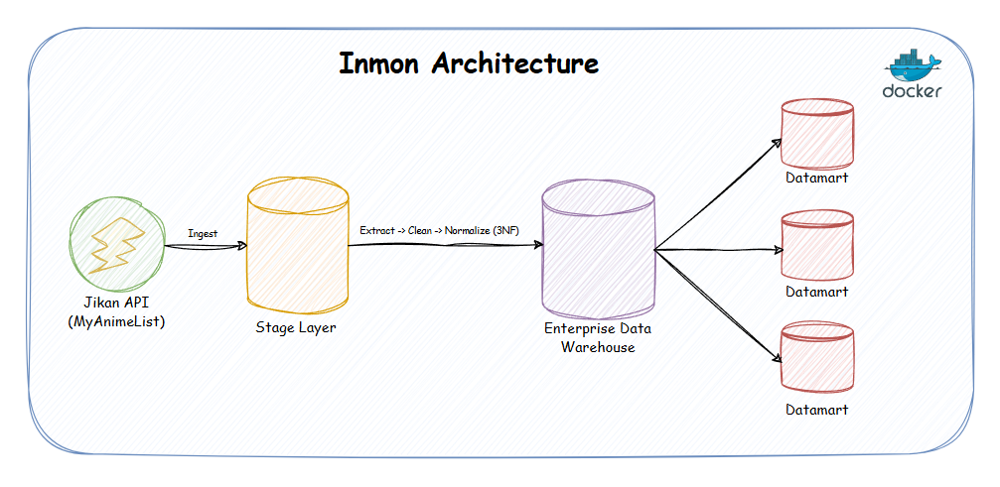
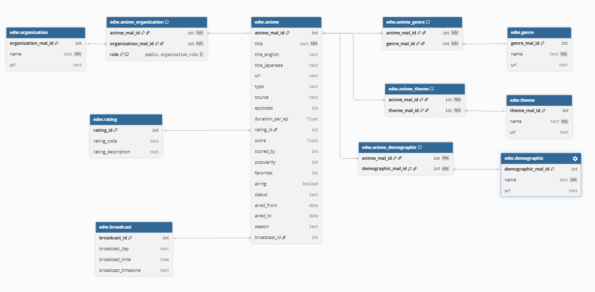
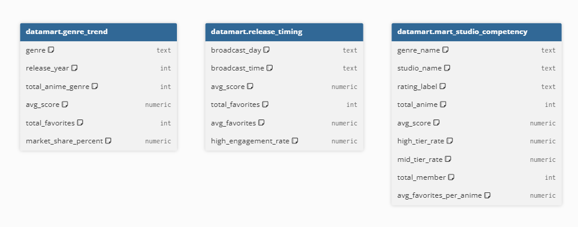

# **1. Project Overview**

This project implements an ETL data pipeline that extracts **real-time** anime data from the **Jikan API** (MyAnimeList). The primary goal of this project is to analyze top-rated anime based on various attributes, along with their broadcasting schedules. 

The analytical views in the Data Mart layer are designed to drive strategic decisions for production studios, streaming platforms, and investors:
* **Market & Genre Trends (`datamart.mart_genre_trend`):** Shows which anime genres are growing or fading over time, and which niche genres fans love the most.
* **Broadcast Schedule Optimization (`datamart.mart_release_timing`):** Shows which days and time slots have the most popular anime, so broadcasters can pick the best air time.
* **Studio Competency Matrix (`datamart.mart_studio_competency`):** Compares studios by their main genres, target audience, and hit-rate (anime scored above 7.5) to find the most reliable studios.

The data warehouse architecture applied in this project follows the **Inmon Architecture (top-down)**, which divides the system into three logical layers:
* **Stage Layer:** Stores raw JSON data directly extracted from the Jikan API.
* **EDW Layer:** Transforms, cleans, and normalizes the data into relational tables (3NF), serving as the single source of truth.
* **Data Mart Layer:** Aggregates and transforms data from the EDW based on specific business and analytical requirements.
<p align="center">
  
</p>

## **1.1 EDW Star Schema**

Inside the EDW layer, the data is modeled as a **star schema** with `edw.anime` at the center:

* **Fact table:** `edw.anime`: holds the measures used for analysis such as `score`, `favorites`, `popularity`, and `episodes`.
* **Dimension tables:** `edw.rating`, `edw.broadcast`, `edw.genre`, `edw.theme`, `edw.demographic`, and `edw.organization` : provide descriptive context for each anime.
* **Bridge tables:** `edw.anime_genre`, `edw.anime_theme`, `edw.anime_demographic`, and `edw.anime_organization`: handle the many-to-many relationships between anime and its dimensions.

<p align="center">
  
</p>

## **1.2 Data Marts**

The Data Mart layer is a set of analytical views built on top of the EDW. Each view answers one specific business question and can be queried directly with SQL, no extra processing needed.

| View | Business Question | Key Columns |
|---|---|---|
| `datamart.genre_trend` | Which genres are growing or fading over time? | `genre`, `release_year`, `total_anime_genre`, `avg_score`, `total_favorites`, `market_share_percent` |
| `datamart.release_timing` | Which broadcast day/time slot has the most engaged viewers? | `broadcast_day`, `broadcast_time`, `avg_score`, `avg_favorites`, `high_engagement_rate` |
| `datamart.mart_studio_competency` | Which studios deliver the best quality in each genre? | `studio_name`, `genre_name`, `rating_label`, `avg_score`, `high_tier_rate`, `mid_tier_rate` |


<p align="center">
  
</p>

# **2. Tech Stack**
* **SQL:** Initializing databases, schemas, and DDL definitions.
* **Python:** Transforming data using **Pandas** and connecting to PostgreSQL via **SQLAlchemy**.
* **Docker:** Containerizing the application and database for seamless deployment.

# **3. Project Structure**

```text
anime-data-pipeline/
├── ddl/
│   ├── 01_create_database.sql
│   ├── 02_create_schema.sql
│   ├── 03_init_stage.sql
│   └── 04_init_edw.sql
├── docker/
│   ├── .dockerignore
│   └── Dockerfile
├── src/
│   ├── stage/
│   │   └── jikan_ingestor.py
│   ├── loader/
│   │   ├── base_loader.py
│   │   ├── stage_loader.py
│   │   └── edw_loader.py
│   ├── orchestrator/
│   │   ├── stage_orchestrator.py
│   │   ├── edw_orchestrator.py
│   │   └── datamart_orchestrator.py
│   ├── transformation/
│   │   ├── datamart/
│   │   │   ├── mart_genre_trend.sql
│   │   │   ├── mart_release_timing.sql
│   │   │   └── mart_studio_competency.sql
│   │   └── edw/
│   │       ├── cleaner.py
│   │       ├── extractor.py
│   │       └── normalizer.py
│   ├── utils/
│   │   ├── db.py
│   │   └── logger.py
│   ├── db_init.py
│   └── main.py
├── .env
├── .gitignore
├── docker-compose.yaml
├── LICENSE
├── README.md
└── requirements.txt
```

# **4. Configuration and Setup**

## **4.1 Configuration** 
Create a `.env` file in the root directory and define the following environment variables:

```env
DB_HOST=postgres
DB_PORT=5432
DB_USER=postgres
DB_PASSWORD=postgres
DB_NAME=postgres
```

## **4.2 Setup & Execution**

1. **Start the containers:** Open your terminal in the root folder and run the following command to build and launch the services:
   ```bash
   docker compose up -d --build
   ```

2. **Database Connection:** Use a database management tool like **Navicat** or **DBeaver** to connect to PostgreSQL through the following configuration:
   ```text
   Connection Name: postgres_docker
   Host: localhost (or 127.0.0.1)
   Port: 5433
   Initial Database: postgres
   User Name: postgres
   Password: postgres
   ```

3. **Run the Pipeline:** After successfully connecting to PostgreSQL, execute the project pipeline through:
   ```bash
   docker exec -it anime_data_pipeline_container python src/main.py
   ```
